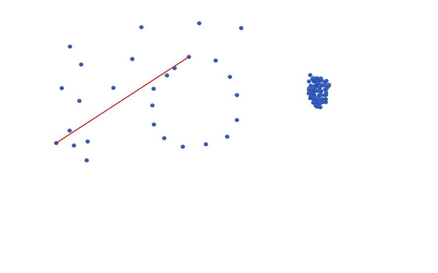
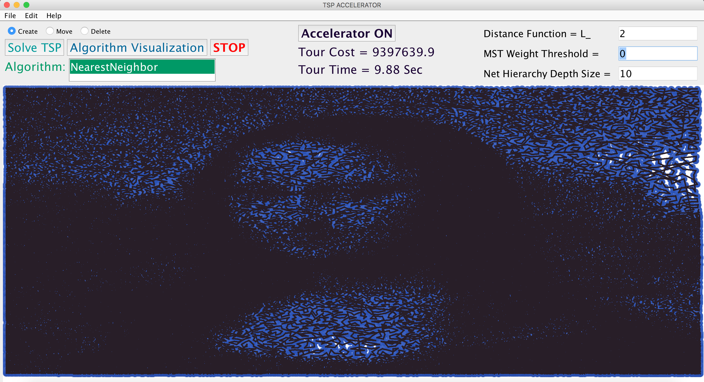

# TSP-Accelerator
Algorithm accelerator for the travelling salesman problem

------------------------------------------------------------------------------------------------------------------------------
- [More about TSP-Accelerator](#more-about-tsp-accelerator)
- [Getting Started](#getting-started)
- [Create New TSP Solver](#create-new-tsp-solver)
- [The Team](#the-team)
------------------------------------------------------------------------------------------------------------------------------

## More about TSP-Accelerator
TSP Accelerator is a java implementation of the paper: "TODO"

## Getting Started
'''
git clone --recursive https://github.com/Pinhas-Nisnevitch/TSP-Accelerator/
cd TSP-Accelerator
ant -f "TSP Accelerator" -Dnb.internal.action.name=rebuild clean jar

Double-Click on: /TSP-Accelerator/TSP Accelerator/dist/TSP_Accelerator.jar
'''

# Accelerating the "Nearest Neighbor" algorithm with 100k points:

## The Team

TSP-Accelerator is currently maintained by [Pinhas Nisnevitch](https://github.com/Pinhas-Nisnevitch)
major contributions coming from Dr. Lee-Ad Gottlieb , Omer Levin and Dina Ankonina.
